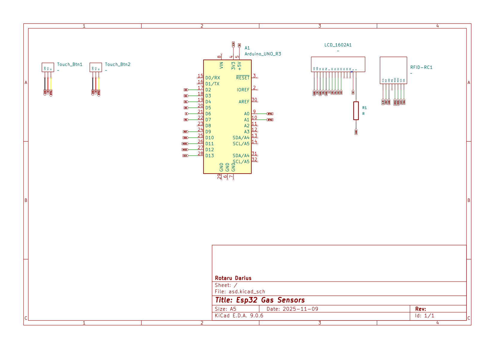

# ATmega328P Account Keeper with Custom SPI, MFCR522, LCD Drivers.

Bare metal C application that showcases and RFID locked account keeper mechanism, that displays your username and blurred password, but upon validating with the correct RFID tag, it reveals the password.

## Components Used:
* **µcontroller:** Arduino Uno3
* **Components:** 1x RFID-RC522, 1x LCD-1602A, 2x Touch Buttons, 1x Potentiometer.
* **Misc:** Resistors, Jumper Wires, Breadboard.

### Schematic | Wiring | Showcase

## Code Structure

* **`main.c`**: Base file where the account display logic, and rfid validation resides.
* **`buttons.c/h`**: Self contained buttons file that initialises the relevant pins and returns their states.
* **`mfrc522.c/h`**: Self contained MFRC522 file that initialises the RFID-RC522 chip, its registers, and handles the anticolission and tag validation (only for cascade Level 1)
* **`spi.c/h`**: Self contained SPI file that initialises SPI, and handles the transfer of data.
* **`lcd.c/h`**: Self contained LCD file that provides minimal LCD functionality, initialises the lcd in 4-bit mode and handles printing, clearing and setting the cursor.
* **`accounts.c/h`:** Self contained file that creates a minimal struct for the accounts, just an id, an username and apssword, and is able to return the number of accoutns and their information.
